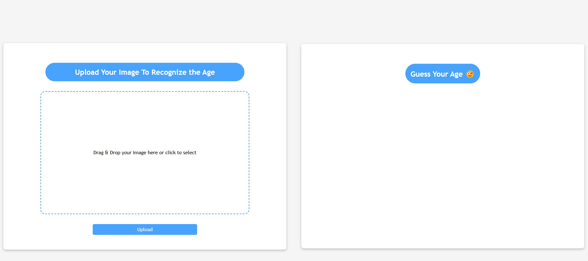

# Age Recognition App using DeepFace

This is a Flask-based web application that uses DeepFace to analyze uploaded images and provide insights about the estimated age, gender, and dominant emotion of the person in the image.

## Features

- Upload an image for analysis.
- Detect the **age**, **gender**, and **dominant emotion** of the individual in the image.
- Handles common file upload errors (e.g., unsupported file types, large file sizes).
- Automatically deletes uploaded files after analysis to avoid clutter.

## Prerequisites

Make sure you have the following installed:

1. Python (>=3.7)
2. Required Python libraries (see below for installation)

## Installation

### 1. Clone the Repository

```bash
git clone https://github.com/sahanamugodage/Age-Recognition-with-DeepFace.git
cd Age-Recognition-with-DeepFace
cd project
```

- python -m venv venv
- source venv/bin/activate # On Windows: venv\Scripts\activate

- pip install -r requirements.txt

## File Structure

Here’s the file structure of the project:

```plaintext
project/
├── src/
│   ├── app.py                # Main Flask application
│   ├── templates/
│   │   └── upload.html       # HTML template for the upload page
│   ├── uploads/              # Temporary storage for uploaded files
│   ├── requirements.txt      # Python dependencies
│   └── README.md             # Project documentation
└── LICENSE                   # License information

```

## Runnuing the Application

```bash
cd project
cd src
python app.py
```

## Running the Application (from the root directory)

```bash
cd project
python src/app.py
```

## The Application Looks Like


